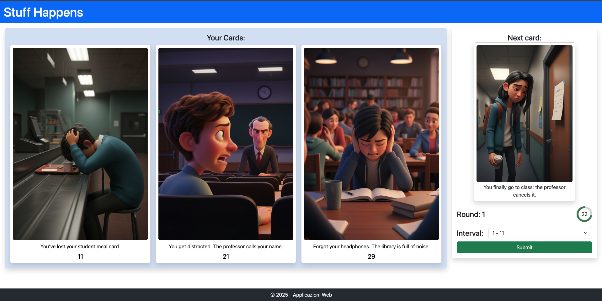
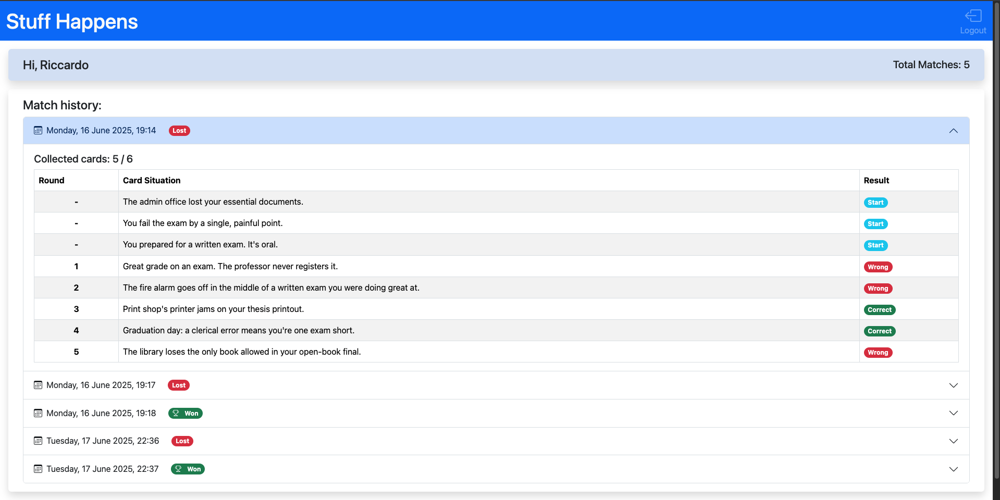

[](https://classroom.github.com/a/uNTgnFHD)
# Exam #1: "Gioco della Sfortuna"
## Student: s342227 MARCONI RICCARDO

## React Client Application Routes

- Route `/`: Pagina Home dove è possibile iniziare una nuova partita e leggere le istruzioni del gioco.
- Route `/match/:gamedId`: Pagina in cui si svolge la partita round per round. Un utente non loggato potrà giocare una partita di un solo round (demo).
- Route `/login`: Pagina contente il form di login.
- Route `/profile`: Pagina in cui un utente loggato può controllare il proprio profilo e la cronologia delle partite giocate.

## API Server

- POST `/api/login`
  - Descrizione: Autenticazione dell'utente e creazione di una nuova sessione.

  - Request parameters: `None`
  - Request body:
    ```json
    {
      "username": "test@polito.it",
      "password": "password"
    }
    ```

  - Response: 
    - `201 Created`: Successo, ritorna le informazioni dell'utente in formato JSON (vedi esempio sotto).
    - `401 Unauthorized`: Credenziali errate
    - `500 Internal Server Error`: Errore del server
  - Response body:
    ```json
    {
      "id": 1,
      "name": "Test",
      "email": "test@polito.it"
    }
    ```

- GET `/api/session/current`
  - Descrizione: Recupera le informazioni della sessione corrente.
  
  - Request parameters: `None`
  - Request body: `None`

  - Response:
    - `200 OK`: Successo, ritorna le informazioni della sessione in formato JSON (vedi esempio sotto)
    - `401 Unauthorized`: Nessun utente loggato
    - `500 Internal Server Error`: Errore del server
  - Response body:
    ```json
    {
      "id": 1,
      "name": "Test",
      "email": "test@polito.it"
    }
    ```

- DELETE `/api/logout`
  - Descrizione: Effettua il logout dell'utente corrente, terminando la sessione.

  - Request parameters: `None`
  - Request body: `None`

  - Response:
    - `200 OK`: Successo, sessione terminata
    - `401 Unauthorized`: Nessun utente loggato
    - `500 Internal Server Error`: Errore del server
  - Response body: `None`

- POST `/api/games/new`
  - Descrizione: Crea una nuova partita per l'utente loggato.

  - Request parameters: `None`
  - Request body: `None`

  - Response:
    - `201 Created`: Successo, ritorna l'ID della nuova partita in formato JSON (vedi esempio sotto)
    - `401 Unauthorized`: Utente non loggato
    - `500 Internal Server Error`: Errore del server
  - Response body:
    ```json
    {
      "gameId": 1
    }
    ```

- POST `/api/games/demo/new`
  - Descrizione: Crea una nuova partita per l'utente non loggato (demo).

  - Request parameters: `None`
  - Request body: `None`

  - Response:
    - `201 Created`: Successo, ritorna l'ID della nuova partita in formato JSON (vedi esempio sotto)
    - `500 Internal Server Error`: Errore del server
  - Response body:
    ```json
    {
      "gameId": 1
    }
    ```
  
- POST `/api/games/:gameId/rounds/new`
  - Descrizione: Inizia un nuovo round per la partita specificata per l'utente loggato.

  - Request parameters: `gameId`, ID della partita
  - Request body: `None`

  - Response:
    - `201 Created`: Successo, ritorna l'ID del nuovo round in formato JSON (vedi esempio sotto)
    - `400 Bad Request`: Utente inizia un nuovo round oltre il quinto
    - `401 Unauthorized`: Utente cerca di iniziare un round di una partita non sua
    - `500 Internal Server Error`: Errore del server
  - Response body:
    ```json
    {
      "roundId": 1
    }
    ```

- POST `/api/games/demo/:gameId/rounds/new`
  - Descrizione: Inizia un nuovo round per la partita specificata per l'utente non loggato.

  - Request parameters: `gameId`, ID della partita
  - Request body: `None`

  - Response:
    - `201 Created`: Successo, ritorna l'ID del nuovo round in formato JSON (vedi esempio sotto)
    - `401 Unauthorized`: Utente inizia un nuovo round oltre il primo. Oppure utente cerca di iniziare un round di una partita non sua
    - `500 Internal Server Error`: Errore del server
  - Response body:
    ```json
    {
      "roundId": 1
    }
    ```

- GET `/api/games/:gameId/rounds/current`
  - Descrizione: Recupera il numero del round corrente (l'ultimo) di una propria partita specificata.

  - Request parameters: `gameId`, ID della partita
  - Request body: `None`

  - Response:
    - `200 OK`: Successo, ritorna l'ID del round corrente in formato JSON (vedi esempio sotto)
    - `401 Unauthorized`: Utente cerca di recuperare il round corrente di una partita non sua
    - `500 Internal Server Error`: Errore del server
  - Response body:
    ```json
    {
      "roundId": 1
    }
    ```

- GET `/api/games/:gameId/rounds/:round/cards`
  - Descrizione: Recupera le carte possedute dall'utente per il round specificato di una propria partita specificata.

  - Request parameters: `gameId`, ID della partita, `round`, numero del round
  - Request body: `None`

  - Response:
    - `200 OK`: Successo, ritorna un array di Carte in formato JSON (vedi esempio sotto)
    - `401 Unauthorized`: Utente non loggato prova a recuperare le carte di un round oltre il primo. Oppure utente cerca di recuperare le carte di un round di una partita non sua
    - `500 Internal Server Error`: Errore del server
  - Response body:
    ```json
    [
      {
        "id": 4,
        "name": "You sit down in the lecture hall, then realize it's the wrong class.",
        "path": "card4.jpeg",
        "rate": 7
      },
      {
        "id": 37,
        "name": "You show up for your exam... two hours after it ended.",
        "path": "card37.jpeg",
        "rate": 73
      },
      {
        "id": 41,
        "name": "You break your dominant hand a week before three written exams.",
        "path": "card41.jpeg",
        "rate": 81
      }
    ]
    ```

- GET `/api/games/:gameId/rounds/:round/cards/next`
  - Descrizione: Recupera la carta da indovinare per il round specificato di una propria partita specificata.

  - Request parameters: `gameId`, ID della partita, `round`, numero del round
  - Request body: `None`

  - Response:
    - `200 OK`: Successo, ritorna la Carta da indovinare in formato JSON (vedi esempio sotto)
    - `401 Unauthorized`: Utente non loggato prova a recuperare la carta di un round oltre il primo. Oppure utente cerca di recuperare la carta di un round di una partita non sua
    - `500 Internal Server Error`: Errore del server
  - Response body:
    ```json
    {
      "id": 48,
      "name": "You miss the single, final deadline to apply for graduation.",
      "path": "card48.jpeg"
    }
    ```

- GET `/api/games/:gameId/rounds/:round/options`
  - Descrizione: Recupera gli intervalli di sfortuna per la carta da indovinare del round specificato di una propria partita specificata.

  - Request parameters: `gameId`, ID della partita, `round`, numero del round
  - Request body: `None`

  - Response:
    - `200 OK`: Successo, ritorna le opzioni in formato JSON (vedi esempio sotto)
    - `401 Unauthorized`: Utente non loggato prova a recuperare le opzioni di un round oltre il primo. Oppure utente cerca di recuperare le opzioni di un round di una partita non sua
    - `500 Internal Server Error`: Errore del server
  - Response body:
    ```json
    {
      "options": [
        "1 - 7",
        "7 - 73",
        "73 - 81",
        "81 - 100"
      ]
    }
    ```

- PUT `/api/games/:gameId/rounds/last`
  - Descrizione: Aggiorna l'ultimo round della partita specificata per l'utente loggato.

  - Request parameters: `gameId`, ID della partita
  - Request body:
    ```json
    {
      "choice": "1 - 7",
    }
    ```
  
  - Response:
    - `200 OK`: Successo, ritorna un messaggio in formato JSON (vedi esempio sotto)
    - `400 Bad Request`: Errore nel body della richiesta (ad esempio, choice mancante)
    - `401 Unauthorized`: Utente non loggato. Oppure utente cerca di aggiornare un round di una partita non sua
    - `500 Internal Server Error`: Errore del server
  - Response body:
    ```json
    {
      "message": "Correct Answer! Round won. Card added to yours.", 
      "type": "success"
    }
    ```

- PUT `/api/games/demo/:gameId/rounds/last`
  - Descrizione: Aggiorna l'ultimo round della partita specificata per l'utente non loggato.

  - Request parameters: `gameId`, ID della partita
  - Request body:
    ```json
    {
      "choice": "1 - 7",
    }
    ```

  - Response:
    - `200 OK`: Successo, ritorna un messaggio in formato JSON (vedi esempio sotto)
    - `400 Bad Request`: Errore nel body della richiesta (ad esempio, choice mancante)
    - `401 Unauthorized`: Utente non loggato prova ad aggiornare un round oltre il primo. Oppure utente cerca di aggiornare un round di una partita non sua
    - `500 Internal Server Error`: Errore del server
  - Response body:
    ```json
    {
      "message": "Correct Answer! Round won. Card added to yours.", 
      "type": "success"
    }
    ```

- PUT `/api/games/:gameId/end`
  - Descrizione: Aggiorna il risultato di una propria partita specificata per l'utente loggato.

  - Request parameters: `gameId`, ID della partita
  - Request body: `None`

  - Response:
    - `200 OK`: Successo, ritorna un messaggio in formato JSON (vedi esempio sotto)
    - `401 Unauthorized`: Utente non loggato. Oppure utente cerca di aggiornare una partita non sua
    - `500 Internal Server Error`: Errore del server
  - Response body:
    ```json
    {
      "message": "Correct answer! You won the match!", 
      "type": "success"
    }
    ```

- GET `/api/games/:gameId/result`
  - Descrizione: Recupera il risultato di una propria partita specificata.

  - Request parameters: `gameId`, ID della partita
  - Request body: `None`

  - Response:
    - `200 OK`: Successo, ritorna il risultato della partita in formato JSON (vedi esempio sotto)
    - `401 Unauthorized`: Utente cerca di recuperare il risultato di una partita non sua
    - `500 Internal Server Error`: Errore del server
  - Response body:
    ```json
    {
      "result": "true"
    }
    ```

- GET `/api/games/list`
  - Descrizione: Recupera la lista delle partite concluse dall'utente loggato.

  - Request parameters: `None`
  - Request body: `None`

  - Response:
    - `200 OK`: Successo, ritorna un array di partite in formato JSON (vedi esempio sotto)
    - `401 Unauthorized`: Utente non loggato
    - `500 Internal Server Error`: Errore del server
  - Response body:
    ```json
    [
      {
        "id": 15,
        "date": "Tuesday, 17 June 2025, 22:39",
        "win": 0,
        "rounds": [
          {
            "number": 0,
            "win": 1,
            "name": "The vending machine just ate your last coin."
          },
          {
            "number": 0,
            "win": 1,
            "name": "You fail the exam by a single, painful point."
          },
          ecc...
        ]
      }
    ]
    ```

## Database Tables

- Table `users` - Memorizza le informazioni degli utenti registrati
  | Field    | Type    |
  | -------- | ------- |
  | idU      | integer |
  | name     | text    |
  | email    | text    |
  | password | text    |
  | salt     | text    |

- Table `Card` - Memorizza le carte del gioco
  | Field | Type    |
  | ----- | ------- |
  | idC   | integer |
  | name  | text    |
  | path  | text    |
  | index | integer |

- Table `Game` - Memorizza le partite giocate dagli utenti
  | Field  | Type    |
  | ------ | ------- |
  | idG    | integer |
  | date   | text    |
  | win    | integer |
  | userId | integer |

- Table `Round` - Memorizza i round delle partite
  | Field  | Type    |
  | ------ | ------- |
  | idR    | integer |
  | number | integer |
  | start  | text    |
  | end    | text    |
  | win    | integer |
  | cardId | integer |
  | gameId | integer |
  | userId | integer |

## Main React Components

- `NavHeader` (in `NavHeader.jsx`): definisce l'header delle pagine, contiene il logo del gioco, i link per accedere alle pagine di login e profilo, e il bottone per il logout.
- `Footer` (in `Footer.jsx`): definisce il footer delle pagine.
- `Home` (in `Home.jsx`): definisce l'home page del gioco. Costituita da `HomeIntro`, in cui è presente un bottone per iniziare una nuova partita, e `HomeRules`, in cui sono presenti le istruzioni del gioco.
- `Game` (in `Game.jsx`): definisce la pagina di gioco. Costituita da due parti: a sinistra è presente il componente `OwnedCards` per mostrare le carte possedute dal giocatore, mentre a destra sono presenti dinamicamente diversi componenti a seconda dello stato del gioco - `StartRound` per avviare un nuovo round, `Choices` per selezionare l'intervallo di sfortuna della carta da indovinare, oppure `EndRound` per concludere la partita e tornare alla home o iniziare una nuova partita.
- `ChoiceForm` (in `ChoiceForm.jsx`): definisce il form per la scelta dell'intervallo di sfortuna della carta da indovinare.
- `LoginForm` (in `LoginForm.jsx`): definisce il form per il login dell'utente.
- `Profile` (in `Profile.jsx`): definisce la pagina del profilo dell'utente. Contiene il componente `MatchList` che mostra la cronologia delle partite giocate, con la possibilità di visualizzare i dettagli di ogni partita.
- `NotFound` (in `NotFound.jsx`): definisce la pagina di errore 404, che viene mostrata quando l'utente cerca di accedere a una route inesistente.

## Screenshot




## Users Credentials

- riccardo.marconi@polito.it, password
- elon.musk@polito.it, password
- (test@polito.it, password)